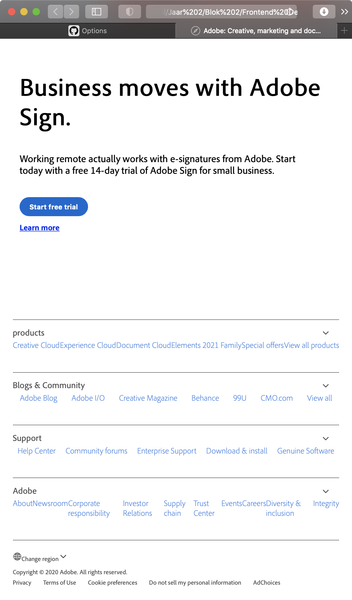
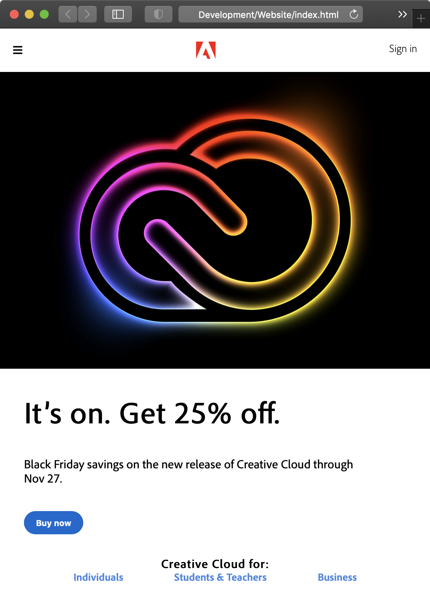
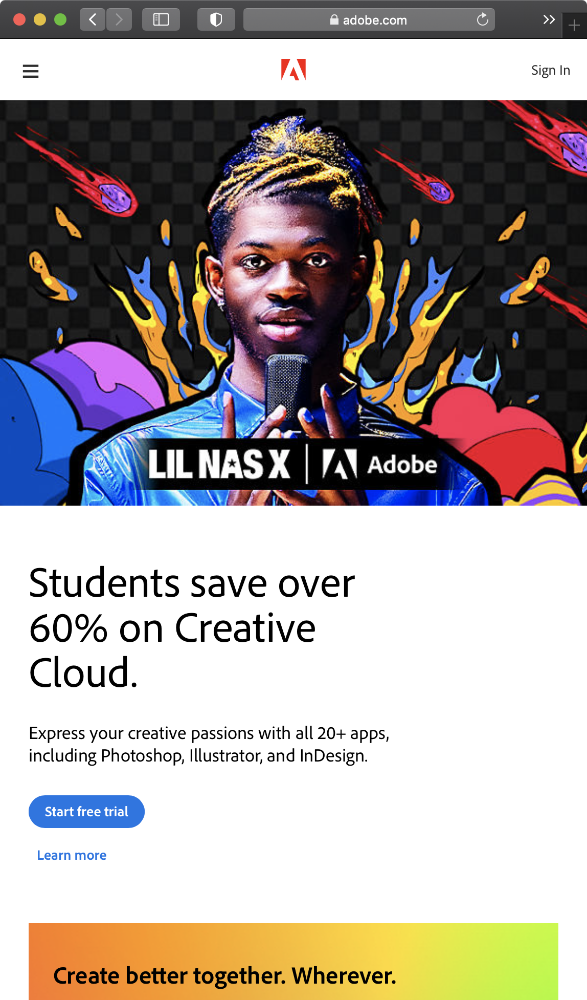
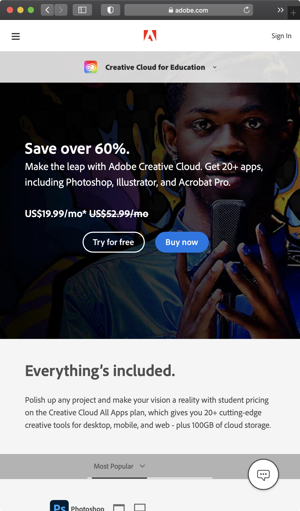

# Procesverslag
**Auteur:** Joost van Grieken

Markdown cheat cheet: [Hulp bij het schrijven van Markdown](https://github.com/adam-p/markdown-here/wiki/Markdown-Cheatsheet). Nb. de standaardstructuur en de spartaanse opmaak zijn helemaal prima. Het gaat om de inhoud van je procesverslag. Besteedt de tijd voor pracht en praal aan je website.

## Bronnenlijst
1. https://www.adobe.com
2. https://www.w3schools.com/cssref/css3_pr_font-face_rule.asp
3. https://developer.mozilla.org/en-US/docs/Web/CSS/background-size
4. https://stackoverflow.com/questions/35285467/how-to-make-a-line-below-text-without-text-decoration-underline
5. https://stackoverflow.com/questions/2504071/how-do-i-combine-a-background-image-and-css3-gradient-on-the-same-element
6. https://stackoverflow.com/questions/18786546/creating-drop-down-menu-on-click-css
7. https://stackoverflow.com/questions/8195215/css-background-image-on-background-color
8. 

## Eindgesprek (week 7/8)

-dit ging goed & dit was lastig-

**Screenshot(s):**

-screenshot(s) van je eindresultaat-

## Voortgang 3 (week 6)

-same as voortgang 1-

## Voortgang 2 (week 5)

De voortgangsgesprek verliep soepel. Ik had wat kleine dingen waar ik tegenaan zat, namelijk; De footer daar had ik de meeste problemen mee (zie screenshot).
De main Is argumenten gelukt. Er zitten nog wat kleine bugs, maar dat is wel op te lossen. 

## Voortgang 1 (week 3)

Menu en header was goed gelukt. Er was wat feedback over hoe ik de main beter kon maken, namelijk: geen list gebruiken voor content maar een section. 

De header is tot nu toe alles wat goed is gegaan.

Na de voortgang gesprek heb ik de feedback verwerkt en is het beter gelukt dan voorheen.

## Breakdownschets (week 1)

## Intake (week 1)

**Je startniveau:** blauw

**Je focus:** responsive

**Je opdracht:** https://www.adobe.com

**Screenshot(s) van de eerste pagina (small screen):**

**Screenshot(s) van de tweede pagina (small screen):**

